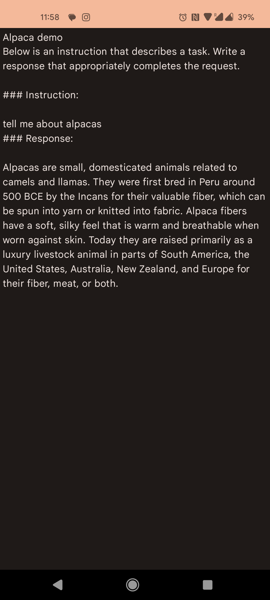

# LLama-Droid

PoC for running [Alpaca](https://github.com/rupeshs/alpaca.cpp) on-device. That uses a modified version of alpaca.cpp to perform inference.

### Requirements
- A device with a >8GB storage, and enough RAM to load the model into memory (>6GB). Download [ggml-alpaca-7b-q4.bin](https://github.com/Karn/alpaca.cpp/tree/master?tab=readme-ov-file#get-started), rename it to `alpaca7b.bin` and upload it to the device in the Application Files Directory under `models`.
- Time, since on-device inference is currently incredibly slow.

### Future work
- What does GPU accelerated inference look like?
- mmap? How, and does it make a difference.
- Consider using a smaller model to improve speed.
